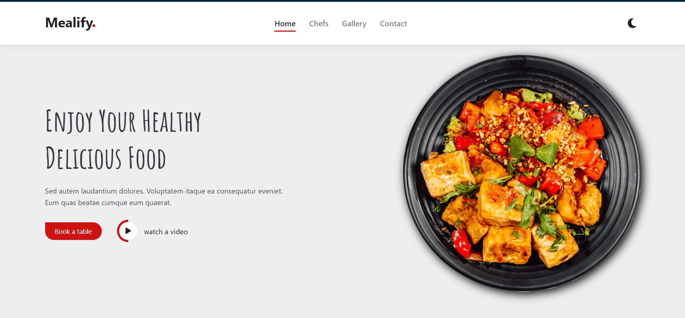

# Hi, I'm Ahmed! 👋

# Mealify

Exciting News! 🎉 

✨ I'm thrilled to announce the launch of "Mealify" – my latest project crafted as Assignment-3 at Route! 🌟

Mealify is a responsive web app designed for food lovers who want an easy, elegant way to browse meal options. Built entirely with HTML, CSS, and media queries, Mealify showcases how powerful simple web technologies can be for creating engaging, user-friendly designs across all devices
 
📌-Technologies Used:
- Html
- Css
- Font Awesome for Icons
- Google Fonts
- Smooth Transitions and hover
- Fully Responsive Design
-- Animation
📱 Fully responsive website! ✅
💪 It's training Flexbox.
🌙 it supports dark mode
Don't forget to give me your feedback ❤️ 
Stay tuned for future updates! 😊

🔗 Demo: 
https://lnkd.in/dRtjB-T5

🔗 Repo:
https://lnkd.in/d-wwgbJB

------

🔗 My account on GitHub :
https://lnkd.in/dvei9dAh

## 🛠 Skills
HTML, CSS...

## 🔗 Links

## Screenshots

